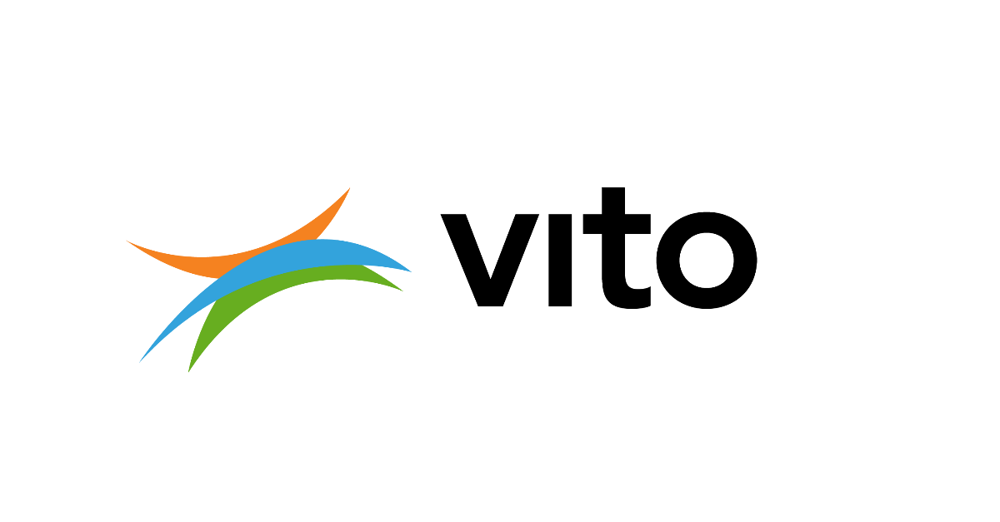

# Welcome to ``modesto``!


``modesto`` is the Multi-Objective District Energy Systems Toolbox for Optimization.
It offers tools to construct optimization problem formulations for district energy systems,
for both design and control.
It uses standard components that can be put together according to the lay-out
of the studied system.

``modesto`` was developed within EnergyVille, which is a Flemish research
collaboration between KU Leuven, VITO, imec and UHasselt.
The main contributors are Annelies Vandermeulen and Bram van der Heijde
(KU Leuven/VITO).



## Installation

If you are just using ``modesto``, please install by running
```commandline
python setup.py install
```

If you are a **developer**, run
```commandline
python setup.py develop
```
from the main folder of modesto.

Tests can be run by using the command
```commandline
python setup.py test
```
or even more simply with the command
```commandline
pytest
```
in the top directory.

You can build and view the documentation by running
```commandline
cd doc
make html
```
and then checking out ``build/html/index.html`` from your favorite browser.

## Getting started
Please check out our tutorial at ``modesto/modesto/Tutorials/Tutorial.ipynb``. This is a [jupyter notebook](http://jupyter.org/install), which should be installed together with modesto if you don't have it yet. jupyter notebooks are an interactive environment that allow you to run the code block by block, such that you can easily understand what each line of code is doing. Feel free to experiment!

## Contributing
We highly appreciate your involvement in the development of ``modesto``. Should you notice any bugs or mistakes, or do you have an idea for a new functionality you would need, please start by opening a ticket in our [issue tracker](https://gitlab.mech.kuleuven.be/u0111619/modesto/issues). You can get started writing code right away by opening a separate branch (use the function in the issue tracker to do this). If you don't have permission to do this, you can still fork the repository. Your code will be added after a merge request, where your code will be reviewed.
